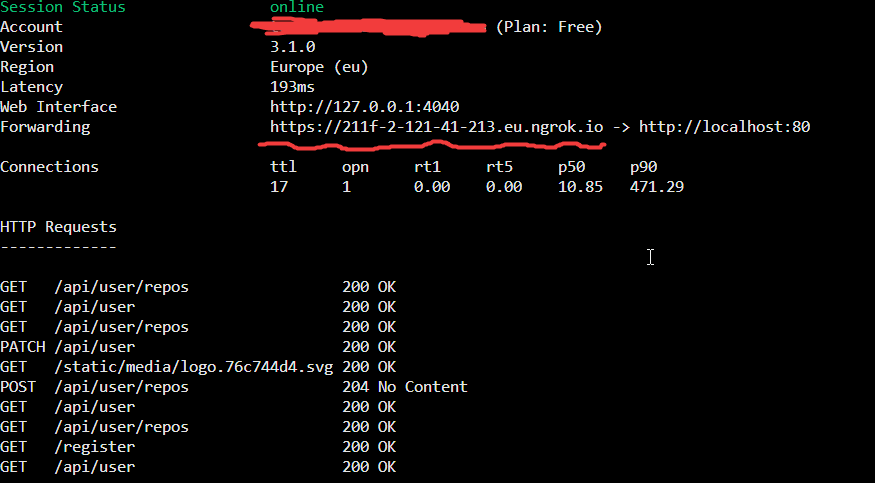
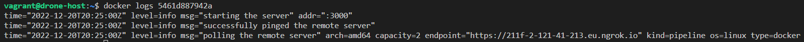
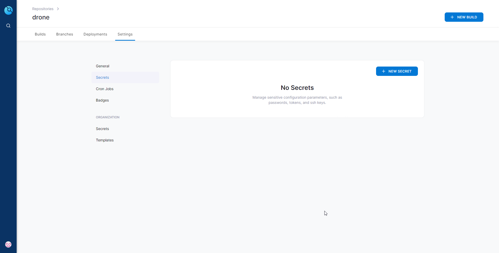
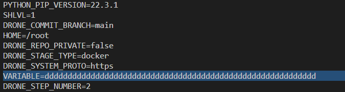

# Drone Overview

Drone is a modern Continuous Integration platform that allows teams to automate their build, test and release workflows. It is built on Docker and written in Go. It more specifically consists of a `Server` and one or many `Runners`. `Runners` are standalone daemons that poll the server for pending pipelines to execute.

This repository outlines the process for setting up both the Drone `Server` and a Drone `Runner`. Click the links below to navigate to the desired section: 

* [Drone Server Installation](#drone-server-installation)
* [Install a Runner](#install-a-docker-runner-on-linux)
* [Managing Drone Secrets](#secrets-per-repository)

# Drone Server Installation

## Ngrok Installation
Your Drone server will need to be publicly accessible. In this example, `ngrok` will be used. Download instructions for Linux can be found [here](https://ngrok.com/download). You can also follow the below steps:

> 1. Run `wget https://bin.equinox.io/c/bNyj1mQVY4c/ngrok-v3-stable-linux-amd64.tgz`.
> 2. Extract ngrok with `sudo tar xvzf your/present/directory/file -C /usr/local/bin`.
> 3. [Sign up](https://ngrok.com/) with ngrok in order to get an authtoken.
> 4. Add the authtoken with ngrok config add-authtoken token-goes-here
> 5. Start ngrok with this command: `ngrok http 80`.
> 6. You will be publicly available at the URL underlined below: 



## Drone Installation for GitHub
You can follow the instructions on [Drone's official documentation page](https://docs.drone.io/server/provider/github/) for installing a Drone server for GitHub. Alternatively, you can follow the steps below:

> 1. [Create a GitHub OAuth application](https://docs.github.com/en/developers/apps/building-oauth-apps/creating-an-oauth-app). You can name the application `Drone`, and for the `Homepage URL` and the `Authorization callback URL`, put in the publicly accessible ngrok URL followed by `/login` at the end.
> 2. Make a note of the `Client ID` and especially the `Client Secret` which you won't be able to see again. 
> 3. In addition to these secrets, create a shared secret by typing this command into the terminal: `openssl rand -hex 16`. Also make a note of this secret.
> 4. Install Docker. Remember you might need to run an update and an upgrade first.
> 5. Pull the Drone docker image with this command: `docker pull drone/drone:2`. 
> 5. Execute this docker run command:
```bash
docker run \
  --volume=/var/lib/drone:/data \
  --env=DRONE_GITHUB_CLIENT_ID=your-id \
  --env=DRONE_GITHUB_CLIENT_SECRET=super-duper-secret \
  --env=DRONE_RPC_SECRET=super-duper-secret \
  --env=DRONE_SERVER_HOST=https://211f-2-121-41-213.eu.ngrok.io \
  --env=DRONE_SERVER_PROTO=https \
  --publish=80:80 \
  --publish=443:443 \
  --restart=always \
  --detach=true \
  --name=drone \
  drone/drone:2
```
The `DRONE_RPC_SECRET` is the secret created by running the command `openssl rand -hex 16`. The server host is the publicly accessible ngrok URL.
> 6. You will be able to access the Drone server by typing the ngrok URL into your browser. 

# Install a Docker runner on Linux

Official documentation for installing the Docker runner on Linux can be found [here](https://docs.drone.io/runner/docker/installation/linux/).

> 1. Pull the public runner image: `docker pull drone/drone-runner-docker:1`.
> 2. Run the below command, replacing the relevant configuration details:
```bash
docker run --detach \
  --volume=/var/run/docker.sock:/var/run/docker.sock \
  --env=DRONE_RPC_PROTO=https \
  --env=DRONE_RPC_HOST=211f-2-121-41-213.eu.ngrok.io \
  --env=DRONE_RPC_SECRET=44711333dd6ed9a9bd7c3aa1c8d72739 \
  --env=DRONE_RUNNER_CAPACITY=2 \
  --env=DRONE_RUNNER_NAME=my-first-runner \
  --publish=3000:3000 \
  --restart=always \
  --name=runner \
  drone/drone-runner-docker:1
```
The `DRONE_RPC_HOST` must point to your ngrok URL and it must not have the `https://` at the start. The `DRONE_RPC_SECRET` is the one created from the `openssl rand -hex 16` command. This must match the secret defined in your Drone server configuration.
> 3. Use the `docker logs container-id-here` command to view the logs. Confirm whether the runner established a connection with your Drone server. The below image acts as an example of what should appear if there is a successful connection:


# Secrets Per Repository

Official documentation for storing secrets can be found [here](https://docs.drone.io/secret/repository/). The steps below may also help:

> 1. Click on the desired repository, click on the `Settings` tab, and on the left-hand side choose `Secrets` as shown below:
 
> 2. Click `NEW SECRET` and enter the key and value pair.
> 3. In your `drone.yaml` file, you can then access this secret as shown below:
```yaml
  steps:
  - name: build
  image: alpine
  environment:
    YOUR_ENVIRONMENT_VARIABLE:
      from_secret: my_secret_test
```
Note: The ephemeral Docker container which spins up when you run the pipeline will contain the environment variable, as shown below:



However, in the console logs for the build, only asterisks (`******`) will appear if you try to print out this environment variable.


