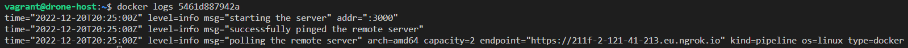

# Install the Docker runner on Linux

Official documentation for installing the Docker runner on Linux can be found [here](https://docs.drone.io/runner/docker/installation/linux/).

> 1. Pull the public runner image: `docker pull drone/drone-runner-docker:1`.
> 2. Run the below command, replacing the relevant configuration details:
```bash
docker run --detach \
  --volume=/var/run/docker.sock:/var/run/docker.sock \
  --env=DRONE_RPC_PROTO=https \
  --env=DRONE_RPC_HOST=211f-2-121-41-213.eu.ngrok.io \
  --env=DRONE_RPC_SECRET=44711333dd6ed9a9bd7c3aa1c8d72739 \
  --env=DRONE_RUNNER_CAPACITY=2 \
  --env=DRONE_RUNNER_NAME=my-first-runner \
  --publish=3000:3000 \
  --restart=always \
  --name=runner \
  drone/drone-runner-docker:1
```
The `DRONE_RPC_HOST` must point to your ngrok URL and it must not have the `https://` at the start. The `DRONE_RPC_SECRET` is the one created from the `openssl rand -hex 16` command. This must match the secret defined in your Drone server configuration.
> 3. Use the `docker logs container-id-here` command to view the logs. Confirm whether the runner established a connection with your Drone server. The below image acts as an example of what should appear if there is a successful connection:

